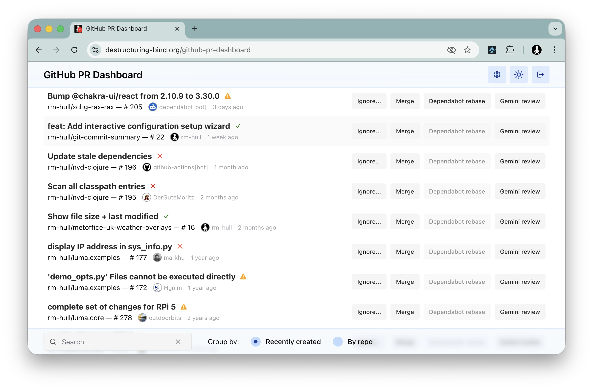
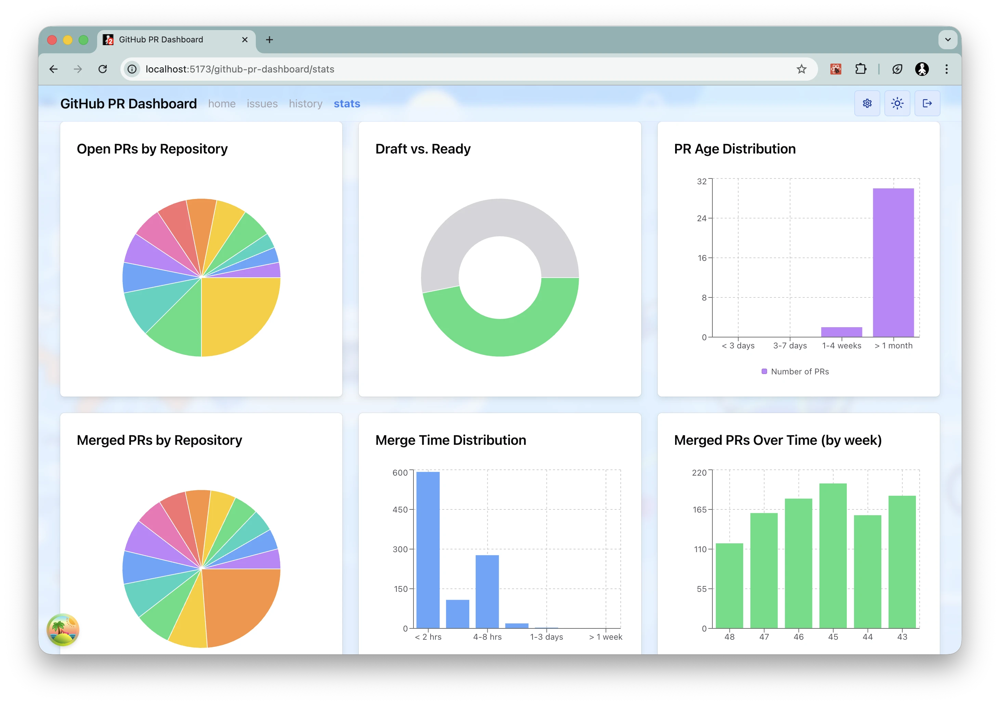

# GitHub PR Dashboard

A streamlined, single-page application designed to help developers manage their GitHub Pull Requests efficiently. Built with performance and usability in mind, this dashboard provides a centralized view of your work across multiple repositories.





## Capabilities

This dashboard is built to simplify your daily workflow with the following features:

*   **Unified Work View:** Aggregates open Pull Requests from all your repositories into a single, sortable list.
*   **Smart Search & Filtering:** Instantly filter PRs by repository, title, or specific search terms.
*   **Quick Actions:**
    *   **One-Click Merge:** Merge PRs directly from the dashboard.
    *   **Rapid Response:** Post pre-defined comments (e.g., triggering `@dependabot rebase`) or custom messages without leaving the interface.
*   **Visual Statuses:** Clear indicators for PR status, CI/CD check results, and review requirements.
*   **Theme Support:** Fully responsive interface with automatic Dark/Light mode support.

## For Contributors

We welcome contributions! This project is a modern React application leveraging the latest tools in the ecosystem.

### Technology Stack

*   **Core Framework:** [React 19](https://react.dev/) & [TypeScript](https://www.typescriptlang.org/)
*   **Build System:** [Vite](https://vitejs.dev/)
*   **Routing:** [TanStack Router](https://tanstack.com/router/latest)
*   **Data & State:** [TanStack Query](https://tanstack.com/query/latest)
*   **UI Components:** [Chakra UI v3](https://chakra-ui.com/)
*   **GitHub Integration:** [Octokit](https://github.com/octokit/octokit.js)

### Getting Started

1.  **Clone the Repository:**
    ```bash
    git clone <repository-url>
    cd github-pr-dashboard
    ```

2.  **Install Dependencies:**
    This project uses Yarn v4.
    ```bash
    yarn install
    ```

3.  **Configure Environment:**
    Create a `.env` file in the root directory by copying the example:
    ```bash
    cp .env.example .env
    ```
    
    You will need to configure the following variables:
    *   `VITE_GITHUB_CLIENT_ID`: Register a new OAuth app on GitHub ([Settings > Developer settings](https://github.com/settings/applications/new)).
        *   **Homepage URL:** `http://localhost:5173`
        *   **Authorization callback URL:** `http://localhost:5173/github-pr-dashboard/`
    *   `VITE_REDIRECT_URI`: Set to `http://localhost:5173/github-pr-dashboard/`
    *   `VITE_SENTRY_DSN`: (Optional) For error tracking.

4.  **Start Development Server:**
    ```bash
    yarn dev
    ```
    Open `http://localhost:5173/` in your browser.

### Development Scripts

*   `yarn dev`: Starts the local Vite development server.
*   `yarn build`: Builds the application for production.
*   `yarn test`: Runs the test suite using Vitest.
*   `yarn lint`: Runs ESLint to ensure code quality.
*   `yarn format`: Formats the codebase using Prettier.

### Architecture & Conventions

*   **Folder Structure:**
    *   `src/components`: Reusable UI components.
    *   `src/routes`: Application routes and page-level components.
    *   `src/hooks`: Custom hooks, primarily for logic and data fetching.
    *   `src/utils`: Helper functions and type definitions.
*   **Code Style:**
    *   We enforce strict linting and formatting. Always run `yarn format` before committing.
    *   This project uses the **React Compiler**, so manual memoization (`useMemo`, `useCallback`) is generally unnecessary unless specifically required for optimization.

---
License: [MIT](LICENSE.md)
